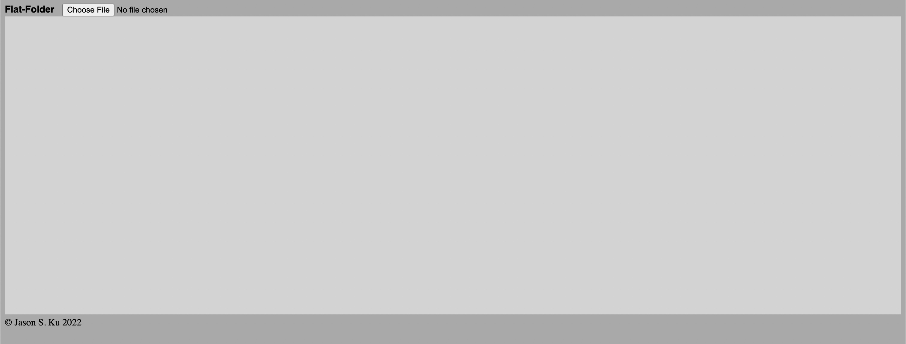
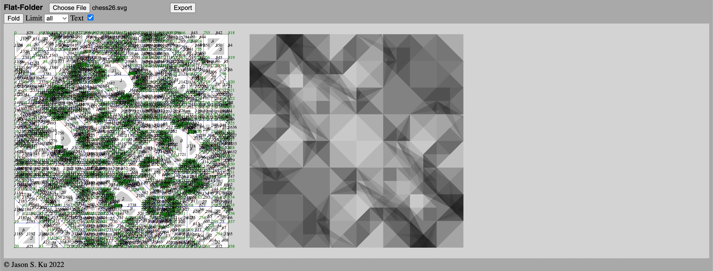
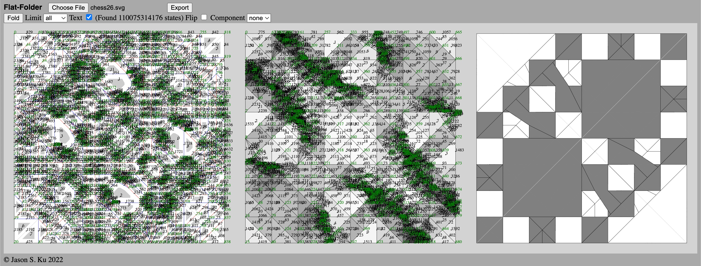
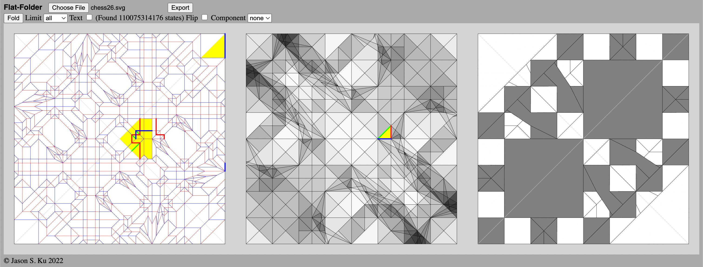
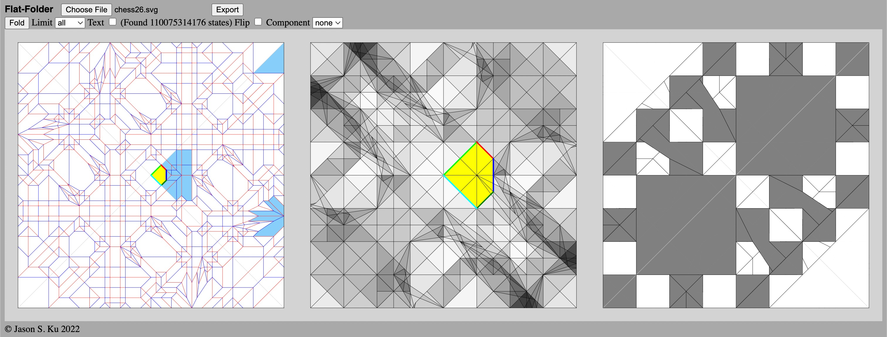
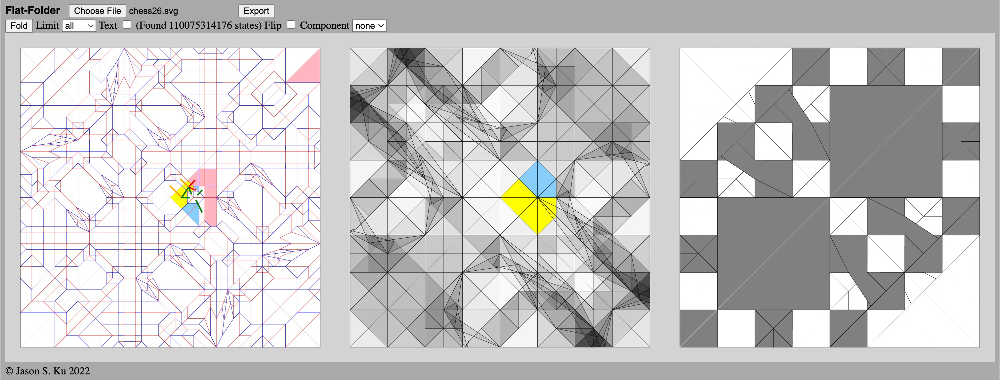
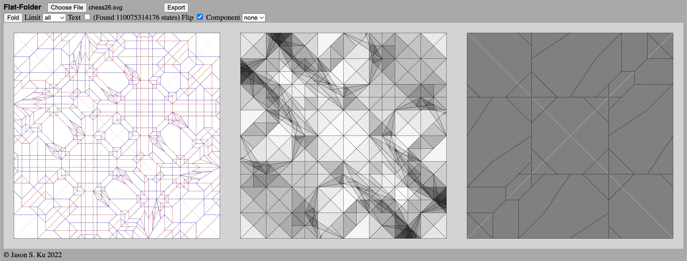
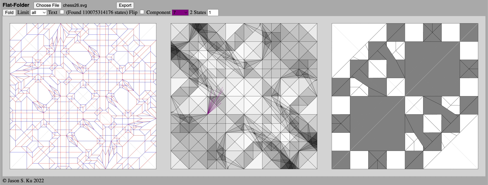
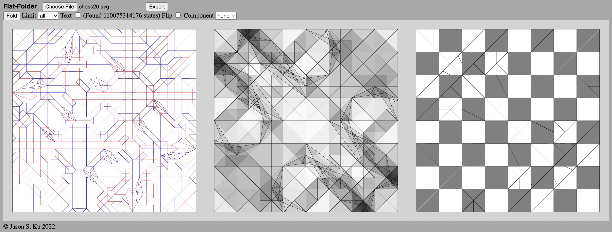
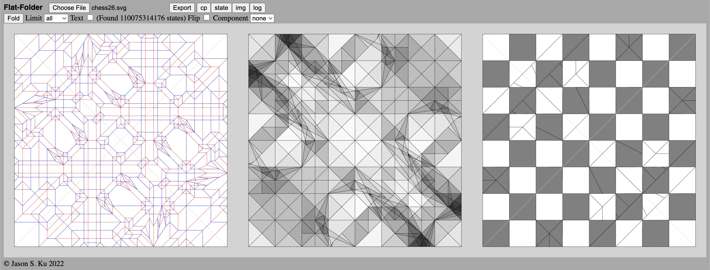

# Flat-Folder: A Crease Pattern Solver

Flat-Folder is software written by [Jason S. Ku](http://jasonku.mit.edu/) to
compute and analyze valid flat-foldable states of flat-foldable crease patterns,
both assigned and unassigned. 

## How to use

1. Go to [Flat-Folder](https://origamimagiro.github.io/flat-folder/).
    - Tested to run in Chrome, Firefox, and Safari.
    - Chrome usually runs slightly faster than Firefox and much faster than Safari.
    - You should see the following interface:

    

1. Press "Upload" to upload a crease pattern in FOLD, SVG, OPX, or CP file formats.
    - Various example files can be found in the
      [`./examples/` folder](https://github.com/origamimagiro/flat-folder/tree/main/examples).
        - You can download them by 
          [clicking here](https://github.com/origamimagiro/flat-folder/archive/refs/heads/main.zip). 
        - If you have examples files that you'd like me to add (and you have 
          the proper authorization of the creator), please 
          [email them to me](mailto:jasonku@me.com)!
    - The software will probably have trouble if points in the input file are
      not accurate to single-precision. When importing any file that does not
      already contain face information, Flat-Folder will look at all the lines
      imported and compute the length $L$ of the shortest one. Then:
        - if any vertex of the input is closer than $\varepsilon = L/300$ 
          to any other vertex, it will assume they are the same vertex; and 
        - if any vertex of the input is closer than $\varepsilon$ to any 
          line, it will assume the vertex is on the line.
    - For SVG format:
        - the import assumes each imported line is an unassigned fold
          (assignment `"U"`), unless its `"style"` attribute contains a
          `"stroke"` whose value is one of `["red", "blue", "gray"]` 
          corresponding to `["M", "V", "F"]` assignments respectively;
        - will also accept values `["#FF0000", "#0000FF", "#808080"]`. 
    - For FOLD format: 
        - Import requires two properties:
            - `vertices_coords`
            - `edges_vertices`
        - Import can also import two optional properties: 
            - `edges_assignment` (if missing, will assume all edges are 
              unassigned `"U"`)
            - `faces_vertices` (if missing, will construct its own set of faces
              from the provided edges)
                - on import, will reorder faces to be increasing by area

1. Once uploaded, Flat-Folder will draw:
    - the crease pattern on left of the display,
    - an x-ray view of the folded crease pattern in the middle of the display, and
    - a red circle behind any vertex of the imported crease pattern that
      violates either Maekawa or Kawasaki's theorems.
        - For Kawasaki, it checks whether the ((sum of even angles) $- \pi$)
          is greater than `0.00001`.

    

    - Selecting the "Text" option will draw index labels for all the vertices,
      edges, and faces in the crease pattern. Currently, there is no way in the
      interface to adjust the font size, so this is only useful for debugging 
      small inputs or by manipulating the text later in an output SVG.

    

1. Press "Fold" to find flat-foldable states of the crease pattern.
    - Flat-Folder will break up the faceOrder variables into disconnected 
      components of variables whose set of solutions are independently 
      assignable from each other.
    - You can limit the number of solutions to find per component by setting the
      "Limit" option:
        - `all` is defaut. This will attempt to compute all possible folded
          states.
        - Alternatively, you can select a number from [1, 10, 100, 1000], which
          will correspond to the maximum number of solutions to find per
          component.

5. After computing the overlap graph:
    - Flat-Folder will replace the x-ray view with the overlap graph.

    

    - Selecting the "Text" option will now also draw index labels for all the 
      cells, segments, and points in the overlap graph.

    

    - Clicking on a cell in the overlap graph will highlight:
        - the faces of the crease pattern that overlap the cell (yellow), and
        - the edges of the crease pattern that overlap the segments bounding
          the cell.

    

    - Clicking on a face of the crease pattern will highlight:
        - the cells of the overlap graph that overlap the face (yellow),
        - the segments of the overlap graph that overlap the edges bounding
          the face, and
        - the other faces of the crease pattern that overlap the selected face
          in the folding (blue). Each blue face corresponds to a faceOrder
          variable (the yellow and blue faces overlap, so much be assigned an order).

        

        - Clicking on one of the blue faces will highlight the
          features of the corresponding faceOrder variable:
            - its two faces (yellow),
            - its taco-taco constraints (green),
            - its taco-tortilla constraints (red),
            - its tortilla-tortilla constraints (orange), and
            - its transitivity constraints (blue).

        

6. After computing solutions for all components:
    - Flat-Folder will display how many valid flat-folded states were found.
    - If any states were found, Flat-Folder will draw a rendering of the first 
      one on the right of the display.

    

    - Selecting the "Flip" option will redraw the folded state as seen from 
      the other side.

    

    - A "Component" dropdown menu is added to aid in selecting other states.
        - The "none" option hides all display of component information.
        - The "all" option draws every component found on the overlap graph in a
          randomly assigned color.

        

        - There is one numeric option (zero-indexed) for each component found.
          Selecting a component will:
            - draw that component on the overlap graph,
            - display the number of states found for that component, and
            - add a numeric input to enter which state to select for that
              component. 

        

        - Changing this number will redraw the flat-folded state based on the
          change.

        

    - You can change states of each component until you reach a desired state.

    

7. Press "Export" to generate export links to various outputs.
    - Clicking "cp" downloads the crease pattern in FOLD format.
    - Clicking "state" downloads the current folded state in FOLD format.
    - Clicking "img" downloads a snapshot of the current display in SVG format.
    - Clicking "log" downloads a text file of all console output since the most
      recent file was imported.

    

## Algorithm

Existing software like [ORIPA](https://github.com/oripa/oripa) and 
[Orihime/Oriedita](https://github.com/oriedita/oriedita) find flat-foldable states by:

1. constructing an overlap graph of cells, where each cell is a maximal regions
   of points in the folded image that overlap the same set of crease pattern
   faces, and
2. finding an ordering of faces in each cell that avoids self-intersection of
   the paper.

Flat-Folder takes a different approach for step (2) that makes it easier to
compress the set of output states. In the following, we take
$n$ to be the number of faces in the input crease pattern.

1. First, it finds each pair of faces `[f, g]` that overlap in the folding and
   identifies the pair as a Boolean variable that can have one of two possible
   assignments: either `f` is over `g` or `g` is over `f`. There are at most
   $O(n^2)$ variables, which are computed by Flat-Folder in $O(n^4)$ time.

2. Next, it computes all constraints on those variables that must be satisfied
   to avoid self-intersection. There are four types of constraints:

    - **Taco-Taco:** A taco-taco constraint occurs when two folded edges `[e1, e2]` 
      of the crease pattern properly overlap along a segment `s` of the overlap
      graph, and of the two faces `[f1, g1]` adjacent to edge `e1` and the two 
      faces `[f2, g2]` adjacent to edge `e2`, all of them lie on the same side 
      of segment `s` in the folding. There are six variables associated with 
      such a constraint:

        - `[f1, g1]`, `[f1, f2]`, `[f1, g2]`, `[f2, g1]`, `[f2, g2]`, `[g1, g2]`
        - Out of the $2^6 = 64$ possible assignments of these variables, only 
          16 of them are valid (avoid intersection).
        - There are at most $O(n^2)$ taco-taco constraints.

    - **Taco-Tortilla:** A taco-tortilla constraint occurs when a folded edge `e` of 
      the crease pattern adjacent to faces `[f1, f2]` properly intersects the 
      interior of a third face `f3` along some segment `s` in the overlap graph. 
      Alternatively, `e` properly overlaps a crease edge `e2` that is not folded 
      in the folding (has assignment `F`), and we let `f3` be the face adjacent 
      to `e2` that lies on the same side of `s` in the folding as `f1` and `f2`. 
      There are are three variables associated with such a constraint:

        - `[f1, f2]`, `[f1, f3]`, `[f2, f3]`
        - Out of the $2^3 = 8$ possible assignments of these variables, only
          4 of them are valid (avoid intersection).
        - There are at most $O(n^2)$ taco-taco constraints.

    - **Tortilla-Tortilla:** A tortilla-tortilla constraint occurs when two crease 
      edges `[e1, e2]` (has assignment `F`) of the crease pattern properly 
      overlap along a segment `s` of the overlap graph, and of the two faces 
      `[f1, g1]` adjacent to edge `e1` and the two faces `[f2, g2]` adjacent to 
      edge `e2`, `f1` and `f2` lie on one side of `s`, and `g1` and `g2` lie on
      the other side of `s`. There are two variables associated with such a 
      constraint:

        - `[f1, f2]`, `[g1, g2]`
        - Out of the $2^2 = 4$ possible assignments of these variables, only
          2 of them are valid (avoid intersection).
        - There are at most $O(n^2)$ taco-taco constraints.

    - **Transitivity:** A transitivity constraint occurs when three faces 
      `[f1, f2, f2]` all mutually overlap the same cell of in the overlap graph. 
      There are are three variables associated with such a constraint:

        - `[f1, f2]`, `[f1, f3]`, `[f2, f3]`
        - Out of the $2^3 = 8$ possible assignments of these variables, only
          6 of them are valid (avoid intersection).
        - There are at most $O(n^3)$ taco-taco constraints.

   The variables and constraints form a bipartite constraint graph with one
   vertex for each variable and constraint, with an edge between a variable
   and a constraint if the constraint is associated with the variable. This
   graph has size $O(n^3)$ and is computed by Flat-Folder in $O(n^5)$ time.

3. If the crease pattern is mountain/valley assigned, each edge assignments
   forces the assignment of one Boolean variable. Flat-Folder makes these
   assignments, and assigns any variables that can be infered from those
   assignments according to the constraints. This step takes $O(n^3)$ time.

4. After removing any the variables that may have been assigned in the last step
   from the constraint graph, the graph may be disconnected into multiple
   unconnected components. If it is variables in one component cannot have any
   effect on variables in another component, so their assignments are independent.
   This step takes $O(n^3)$ time.

5. Lastly, Flat-Folder finds valid solutions for each connected component of
   variables via a brute-force search. This step can take exponental time
   $2^{O(n^2)}$ but if each component has only a polynomial number of solutions, 
   solving each connected component independently can implicitly represent an 
   exponential number of folded states in polynomial time. 
